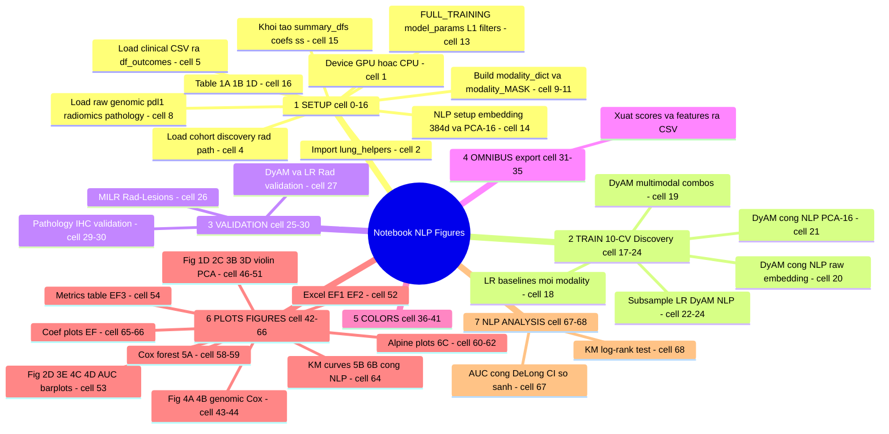
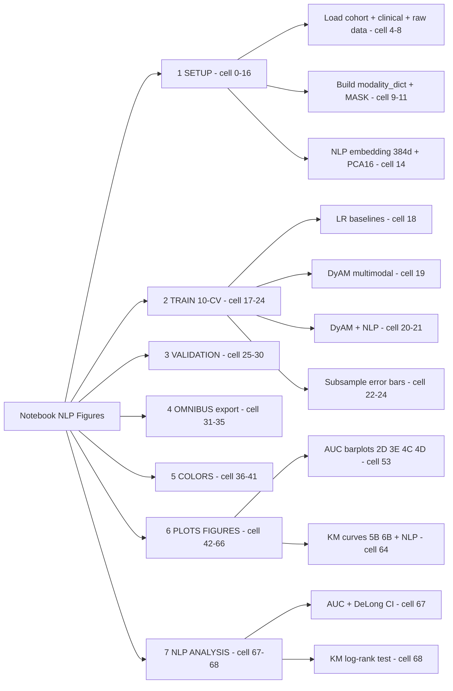

# Biểu đồ tư duy: `Figures-Finalized-NLP.ipynb`

Notebook tạo **tất cả figures cho paper**, kèm phần mở rộng so sánh **NLP Clinical Embedding**.
Tổng cộng 69 cells. Đóng góp riêng so với `Figures-Finalized.ipynb` gốc là các cell **14, 20–21, 24, 67–68** (tạo embedding, train NLP, so sánh).

---

## Mind map (Mermaid)



> Nếu viewer báo lỗi `mindmap` (Mermaid < v9.3), dùng sơ đồ flowchart tương đương dưới đây.

## Mind map (phiên bản flowchart - tương thích rộng)



---

## 1. SETUP — Chuẩn bị dữ liệu (cell 0–16)

| Cell | Làm gì |
|------|--------|
| 1 | Chọn `device` GPU/CPU |
| 2 | `from lung_helpers import *` — nạp toàn bộ thư viện lõi (~5300 dòng) |
| 4 | Tách cohort thành 3 nhóm: `discovery` (train), `rad_valid`, `path_valid` |
| 5 | Đọc clinical CSV cho từng cohort → `df_outcomes` chỉ giữ cột `label` (0 = đáp ứng, 1 = không) |
| 8 | Đọc dữ liệu thô: genomic, TMB, PD-L1, radiomics (gốc + validation), pathology texture & GLCM |
| **9** | **Trái tim của setup**: xây `modality_dict` (dữ liệu) + `modality_MASK` (bệnh nhân nào có modality nào). Tách radiomics theo vị trí tổn thương PC/PL/LN/LU, thêm pathology/genomic/clinical |
| 10–11 | Lặp lại cho cohort validation (radiology & pathology) |
| 13 | `FULL_TRAINING=True` (train hết). Định nghĩa `model_params` (epochs=125, lr=0.01...) và các bộ lọc L1 cho radiomics |
| **14** | **Phần NLP mới**: biến 13 cột clinical → embedding 384 chiều (`cnl_nlp_embedding`), rồi PCA xuống 16 chiều (`cnl_nlp_pca16`). ⚠️ Đánh dấu `no_scale` để RobustScaler không phá embedding |
| 15 | Khởi tạo 3 dict lưu kết quả: `summary_dfs`, `summary_coefs`, `summary_dfs_ss` |
| 16 | Sinh Table 1A/1B/1D (thống kê mô tả cohort) |

## 2. TRAIN 10-fold CV trên Discovery (cell 17–24)

Phần huấn luyện chính, mỗi dòng đổ kết quả vào `summary_dfs[tên_model]`:

- **Cell 18** — Baseline **Logistic Regression** cho từng modality riêng (Rad-PC/PL/LN, IHC, PDL1, Gen, TMB...).
- **Cell 19** — Mô hình chính **DyAM** (Dynamic Attention Multimodal) với nhiều tổ hợp modality. Hai dòng đầu là **baseline không có clinical**; hai dòng `+Labs` là **mục tiêu so sánh** (clinical thô 13 cột).
- **Cell 20** — DyAM **+ NLP embedding 384d** (đóng góp chính).
- **Cell 21** — DyAM **+ NLP PCA-16**.
- **Cell 22–24** — Lặp lại tất cả bằng **`train_subsample`** (ShuffleSplit) để có error bar cho biểu đồ.

Pattern lặp lại khắp nơi:
```python
data, mask, labels = get_training_data([danh sách modality], modality_dict, modality_MASK, df_outcomes)
summary_dfs['Tên'], _ = train(data, mask, labels, filter, model_params)
```

## 3. VALIDATION trên cohort độc lập (cell 25–30)
Gộp discovery + validation rồi train trên discovery, **đánh giá trên validation** (`train_eval_all` / `train_LR_eval_all`). Gồm radiology (cell 26–27) và pathology IHC (cell 29–30). `MILR` = Multiple-Instance LR cho nhiều tổn thương.

## 4. OMNIBUS export (cell 31–35)
Gom mọi `score` của các model + đặc trưng từng modality, ghi ra `./omnibus/parts/*.csv` để phân tích downstream.

## 5–6. COLORS & PLOTS (cell 36–66)
Toàn bộ figures cho paper, mỗi cell lưu file `.svg` vào `vector_figs/`:

| Figure | Cell | Nội dung |
|--------|------|----------|
| 4A/4B | 43–44 | Genomic LR + Cox forest plot |
| 1D/2C/3B/3D | 46–51 | Violin plots, PCA, IHC vs PD-L1 |
| EF1/EF2 | 52 | Xuất raw scores ra Excel |
| **2D/3E/4C/4D** | **53** | **Barplot AUC** so sánh tất cả model (gồm cả NLP) — figure chính |
| EF3 | 54–55 | Bảng metrics (AUC/F1/...) + LaTeX |
| 5A | 58–59 | Cox forest plot covariate |
| 6C | 60–62 | Alpine plots (attention vs AUC/HR/PFS) |
| **5B/6B** | **64** | **Kaplan-Meier survival curves**, có thêm biến thể NLP |
| EF | 65–66 | Coefficient plots + heatmap tương quan |

## 7. PHÂN TÍCH NLP (cell 67–68) — phần kết luận
- **Cell 67** — In bảng so sánh **AUC + khoảng tin cậy DeLong 95%** giữa 4 biến thể: *No Clinical / +Labs / +NLP raw / +NLP-PCA16*, cho cả IHC-A và IHC-G. Bằng chứng định lượng NLP có cải thiện hay không.
- **Cell 68** — **Log-rank test** trên đường KM để kiểm tra phân tầng bệnh nhân có ý nghĩa thống kê.

---

## Luồng dữ liệu tổng thể

```
Raw CSV/parquet
   └─> modality_dict + modality_MASK   (cell 9-11, 14)
          └─> get_training_data(...)    → (data, mask, labels)
                 └─> train / train_LR / train_subsample / *_eval_all
                        └─> summary_dfs[...] / summary_coefs[...]
                               └─> generate_*_plot_V2(...) → vector_figs/*.svg
                               └─> auc_roc_ci(...)         → bảng so sánh NLP
```

**Điểm cốt lõi:** notebook xoay quanh 3 dictionary kết quả (`summary_dfs`, `summary_coefs`, `summary_dfs_ss`). Mọi cell train chỉ *đổ thêm* model vào đó, mọi cell plot chỉ *đọc ra* để vẽ.
