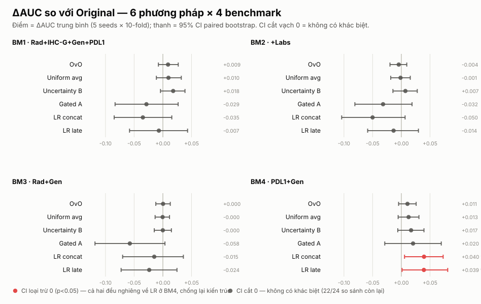

# Kết quả: Thiết Kế Lại Cơ Chế Attention

> Ngày: 2026-07-21 · Cohort: n = 247, label `{1: 185, 0: 62}` (25% responder) · Đánh giá: 5 seeds × 10-fold CV, paired bootstrap 2000 lần trên bệnh nhân · SE(AUC) Hanley–McNeil ≈ 0.032

## Câu hỏi ban đầu

> *"Có thể dựng một mô hình fusion chạy tốt hơn cơ chế attention hiện tại (`AttentionMatrix` / `AttentionMatrixOvO`) không?"*

Đã thử **4 phương pháp mới** cộng **2 baseline hồi quy logistic**, đánh giá đầy đủ trên 4 benchmark cố định. Tiêu chí GIỮ đặt trước: ΔAUC ≥ +0.015 trên ≥3/4 config **và** paired bootstrap p < 0.10 trên BM1.

**Không phương pháp nào đạt tiêu chí.** Cả hai phương pháp mới (`A_gated_logodds`, `B_uncertainty_fusion`) đã bị **xóa** theo kỷ luật GIỮ/XÓA. Kết luận khoa học nằm ở *lý do* không có gì thắng.

---

## Bảng kết quả cuối (mean ± sd AUC, 5 seeds × 10-fold)

| BM | Config | Original | OvO | Gated A | Uncertainty B | Uniform avg | LR concat | LR late |
|---|---|---|---|---|---|---|---|---|
| **BM1** | Rad+IHC-G+Gen+PDL1 | 0.7595 ± 0.0221 | 0.7728 ± 0.0197 | 0.7330 ± 0.0173 | **0.7792 ± 0.0255** | 0.7746 ± 0.0186 | 0.7276 ± 0.0179 | 0.7615 ± 0.0102 |
| **BM2** | +Labs | 0.7638 ± 0.0179 | 0.7632 ± 0.0097 | 0.7288 ± 0.0260 | 0.7718 ± 0.0073 | 0.7665 ± 0.0110 | 0.7112 ± 0.0195 | 0.7556 ± 0.0054 |
| **BM3** | Rad+Gen | 0.7095 ± 0.0177 | 0.7132 ± 0.0150 | 0.6504 ± 0.0226 | 0.7101 ± 0.0138 | 0.7110 ± 0.0148 | 0.6908 ± 0.0087 | 0.6968 ± 0.0083 |
| **BM4** | PDL1+Gen | 0.7072 ± 0.0088 | 0.7183 ± 0.0115 | 0.7317 ± 0.0054 | 0.7262 ± 0.0110 | 0.7191 ± 0.0084 | 0.7472 ± 0.0110 | **0.7515 ± 0.0084** |

Mọi con số nằm trong dải **0.65 – 0.78**; chênh lệch giữa cột tốt nhất và tệ nhất trên cùng một BM (bỏ Gated A) ≤ 0.05, phần lớn ≤ 0.02 — nhỏ hơn SE(AUC) ≈ 0.032.

## Hình: ΔAUC so với Original với 95% CI

*24 so sánh (6 phương pháp × 4 benchmark). Chỉ **2** thanh loại trừ vạch 0 — LR concat (+0.040, p=0.026) và LR late (+0.039, p=0.045) trên BM4 — và cả hai đều **nghiêng về hồi quy logistic**, chống lại kiến trúc attention. 22/24 so sánh còn lại có CI cắt 0.*

---

## Ba kết luận đầu ra

### 1. OvO không khác Original — con số headline cũ 0.80 là ảo giác chọn seed

Cả 4 config: |Δ(OvO − Original)| ≤ 0.011, p ≥ 0.17. Nguyên nhân gốc (Step 2): OvO attention **trơ về mặt chức năng** — trọng số của nó lệch trung bình chỉ **0.012** so với phép chia đều theo mask `maskᵢ/Σmask` (thang [0,1]). Nó không học trọng số riêng cho từng bệnh nhân, nên không thể khác Original một cách hệ thống.

Con số cũ **AUC = 0.8003** (`document/ovo-model/`) là sản phẩm của một phân hoạch CV thuận lợi do `KFold(random_state=0)` cố định; trung bình trên 5 phân hoạch là **0.7728 ± 0.0197**. Mọi phát biểu trong paper dựa trên 0.80 cần viết lại.

### 2. Toàn bộ giá trị của attention nằm ở phép CHUẨN HOÁ, không ở trọng số học được (null result chặt)

Ablation Step 7 thay toàn bộ attention học được bằng hằng số `1/Σmask` (`uniform_avg`):

| BM | Δ(uniform_avg − original) | 95% CI | p |
|---|---|---|---|
| BM1 | +0.0098 | [−0.0117, +0.0322] | 0.364 |
| BM2 | −0.0014 | [−0.0186, +0.0154] | 0.907 |
| BM3 | −0.0004 | [−0.0126, +0.0114] | 0.959 |
| BM4 | +0.0127 | [−0.0048, +0.0301] | 0.161 |

**CI rất hẹp (±0.012 – 0.032)** — đây không phải "thiếu lực thống kê" mà là **loại trừ được mọi hiệu ứng > ~±0.02**. Ngược lại, tắt phép chia (`Σ tanh(rᵢ)` thay vì trung bình) thì **hỏng** (−0.02 đến −0.034, p=0.053 trên BM2). Kết hợp: *giá trị của cơ chế đến từ việc chia cho số modality có sẵn — một phép hiệu chỉnh số học, không cần mạng nơ-ron.* `cross_modality_enabled` hoàn toàn trơ (≤ +0.0034, p ≥ 0.53) mà tốn N² lớp linear → **luôn để `False`**.

### 3. Ngay cả khi làm attention hoạt động thật, nó vẫn không cải thiện; và neural không vượt LR

Phương pháp B (precision fusion) **sửa được** vấn đề trơ — trọng số lệch 0.1397 so với chia đều, gấp 11× OvO — attention thật sự học theo bệnh nhân. Nhưng chênh so với `uniform_avg` (không attention) ≤ 0.007 trên cả 4 config. **Làm attention hoạt động không chuyển thành hiệu năng.**

So với baseline trung thực: mô hình neural **không vượt** late-fusion LR (Δ ≤ 0.027, không config nào p < 0.05 theo hướng ủng hộ neural). Kết quả p < 0.05 **duy nhất** của cả dự án — `lr_late` vs Original trên BM4 (+0.0393, p=0.045) — nghiêng về **LR**, chống lại kiến trúc hiện tại.

---

## Bài học kỹ thuật (đừng lặp lại)

- **Phương pháp A** (bỏ `tanh` + bỏ `Σaᵢ=1`): thua ở mọi config có radiomics (−0.03 đến −0.06), chỉ thắng BM4 (config không radiomics). `tanh` + `Σaᵢ=1` là **regularization ngầm**, không phải khuyết điểm — với n=247 và 62 ca thiểu số, gỡ chúng ra gây overfit đúng ở radiomics (nhiều feature tương quan).
- `LayerNorm(1)` **xoá sạch** modality 1 feature (`cnl_pdl1_score` → luôn = 0). Dùng `Identity` cho modality đơn feature.
- 3 bug trong `lung_helpers` (xem Nhật ký plan): tham số `seed` vô hiệu (KFold hardcode `random_state=0`, `manual_seed(42)` trong `__init__`); OvO `predict_proba` thiếu `.to(device)` (đã sửa); cột `attn_*` của OvO là hàng ma trận outer-product, **không dùng được để diễn giải**.

## Khuyến nghị

1. **Cho paper hiện tại:** thay mọi headline 0.80 bằng bảng 5-seed; mô tả cơ chế fusion trung thực là *"trung bình có mask"*, không phổng lên thành attention học được. Báo cáo `uniform_avg` như một baseline mạnh — nó ngang hoặc hơn cả Original lẫn OvO.
2. **Cho hướng nghiên cứu:** trên cohort n≈250 này, đòn bẩy không nằm ở kiến trúc fusion (đã cạn) mà ở **dữ liệu/feature** hoặc **cohort lớn hơn**. Muốn attention có đất dụng võ cần n lớn hơn nhiều để tín hiệu vượt SE ≈ 0.032.

## Nguồn dữ liệu (tái lập)

`experiments/results/`: `baseline.json` (Original, OvO) · `method_A.json` · `method_B.json` (unc_B, uniform_avg) · `baseline_lr.json` (lr_concat, lr_late) · `ablation.json` · `diagnostics.json`. Score từng bệnh nhân trong `results/scores/*.csv`. Baseline không-attention giữ tại `experiments/baselines/model_uniform_avg.py` (tái lập khớp 1e-9). Folder A/B đã xóa theo tiêu chí GIỮ/XÓA.
