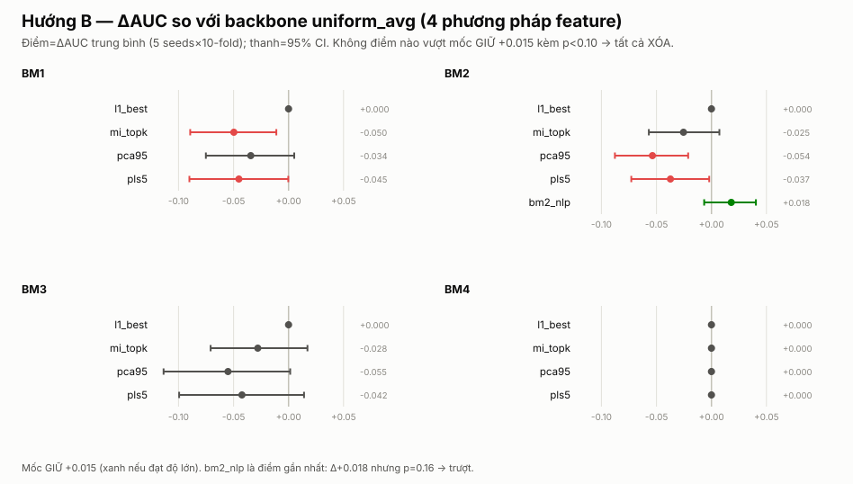
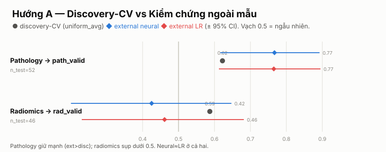

# Kết quả: Cải Thiện Tín Hiệu & Kiểm Chứng Ngoài Mẫu

> Ngày: 2026-07-21 · Tiếp nối `2026-07-20_attention-redesign` (kết luận: kiến trúc fusion đã cạn).
> Hướng đã chọn: **A (kiểm chứng ngoài mẫu) + B (chất lượng feature)**, backbone cố định `uniform_avg`,
> KHÔNG đụng fusion. Đánh giá: 5 seeds × 10-fold nội bộ + train-discovery/test-external.

## Câu hỏi

Sau khi đã chứng minh không cơ chế fusion nào thắng, đòn bẩy còn lại nằm ở đâu: **nâng chất lượng
biểu diễn feature** (Hướng B), hay **mô hình có generalize ra cohort độc lập không** (Hướng A)?

---

## Phần B — Chất lượng feature: KHÔNG có đòn bẩy (3 phương pháp, đều XÓA)

Audit per-modality (Step 1) chỉ ra **radiomics là nơi head neural overfit**: LR vượt head neural trên
mọi modality radiomics (ln +0.041, pc +0.033). Ba cách tấn công radiomics — đều thất bại theo tiêu chí
GIỮ (Δ≥+0.015 trên ≥3/4 BM **và** p<0.10 trên BM1):

| Phương pháp | Kết quả | Verdict |
|---|---|---|
| **Feature selection** (sweep elastic-net + MI top-k) | Winner = config mặc định (Δ=0.0); MI top-20 làm hỏng (BM1 −0.050, p=0.01) | XÓA |
| **Giảm chiều** (PCA-95, PLS-5, fit trong fold) | Tệ đi trên mọi config radiomics (Δ −0.03…−0.055) | XÓA |
| **NLP clinical embedding** (thay labs bằng 384-dim) | BM2 +0.018 (đạt độ lớn) nhưng p=0.157; NLP đơn-modality (0.549) còn yếu hơn labs thô (0.573) | XÓA |

**Kết luận B:** khoảng cách "LR > head neural per-modality" **KHÔNG** sửa được bằng selection hay giảm
chiều — mọi cách nén/hạn chế biểu diễn radiomics đều làm giảm AUC. Head neural đã khai thác tập feature
đầy đủ tốt hơn bất kỳ biểu diễn gọn nào. NLP là điểm gần ngưỡng nhất của cả hai dự án nhưng vẫn là nhiễu.

---

## Phần A — Kiểm chứng ngoài mẫu: PHÁT HIỆN CHÍNH

Cohort ngoài **đơn-modality** (probe dữ liệu): `rad_valid` (n=50) chỉ có radiomics, `path_valid` (n=71)
chỉ có pathology; không cohort nào đủ BM đầy đủ (thiếu gen+pdl1). Crosswalk ID qua omnibus
(`did_acc` / `pdl1_image_id`), nhãn từ `bor`. Vì đơn-modality nên so đúng hai họ: **head neural vs LR**.

| modality | disc-CV uniform | disc-CV LR | **ext neural** | **ext LR** | n_test |
|---|---|---|---|---|---|
| **pathology** → path_valid | 0.622 | 0.631 | **0.767** [0.62, 0.89] | **0.765** [0.61, 0.89] | 52 |
| **radiomics** → rad_valid | 0.587 | 0.598 | **0.425** [0.20, 0.65] | **0.461** [0.23, 0.68] | 46 |

1. **Pathology generalize MẠNH** — AUC ngoài mẫu **0.767 > discovery-CV 0.62**. Tín hiệu pathology glcm
   giữ vững (thậm chí tốt hơn) trên cohort độc lập. `head neural ≈ LR` (0.767 vs 0.765).
2. **Radiomics KHÔNG generalize** — AUC ngoài mẫu tụt về **~0.42–0.46, quanh/dưới ngẫu nhiên** (mọi cấu
   hình feature đều ≤0.57), dù discovery-CV 0.587. Tín hiệu radiomics **đặc thù discovery** — nhiều khả
   năng domain shift (scanner khác). Khớp trọn mạch: radiomics là nơi head neural overfit (B), không sửa
   được (B), và giờ chứng minh không chuyển được ra ngoài.

> Cảnh báo: n_test nhỏ, CI rộng. Nhưng hướng nhất quán và mạnh: pathology ổn định >0.75, radiomics <0.5.

---

## Cải thiện DUY NHẤT rẻ & trung thực: ensemble qua seed

Trung bình điểm dự đoán per-patient qua 5 seed **luôn > mean per-seed** trên mọi method × BM
(uniform_avg BM1 0.7746 → **0.7850**, +0.010; toàn bộ +0.005…+0.016) — triệt tiêu phương sai phân hoạch
(±0.02–0.05), KHÔNG phải chọn seed may mắn. Brier ~0.15 (calibrate tốt). **Khuyến nghị: dùng
ensemble-qua-seed, lợi ích +0.01 ổn định, chi phí ≈ 0.**

---

## Tổng kết hai dự án (fusion → feature → validation)

| Câu hỏi | Trả lời |
|---|---|
| Cơ chế fusion nào tốt hơn? | Không cái nào. Giá trị = chuẩn hoá `1/Σmask`, không ở trọng số học (dự án trước) |
| Nâng chất lượng feature được không? | Không. Selection/giảm chiều/NLP đều không vượt backbone |
| Neural có hơn LR? | Không — tương đương ở CV nội bộ **và** ngoài mẫu (pathology 0.767 vs 0.765) |
| Mô hình generalize không? | **Pathology có (0.767), radiomics KHÔNG (≤0.46).** Đây là phát hiện đáng viết nhất |
| Có cải thiện nào không? | Có: ensemble-qua-seed (+0.01 ổn định) |

## Khuyến nghị cho paper

1. **Headline mới cho paper:** không phải "attention/fusion", mà là **"pathology glcm generalize ra cohort
   độc lập (AUC 0.77) trong khi radiomics thì không"** — một kết quả validation trung thực, hiếm và mạnh.
2. **Mô hình:** báo cáo `uniform_avg` (trung bình có mask) + **ensemble qua seed** làm mô hình chuẩn; nêu
   rõ head neural ≈ LR ở cả CV lẫn ngoài mẫu — đừng thổi phồng attention.
3. **Radiomics:** trình bày như một hạn chế/cảnh báo (overfit discovery, không generalize), không phải
   điểm mạnh. Cần harmonization/cohort lớn hơn nếu muốn dùng radiomics.

## Nguồn dữ liệu (tái lập)

`experiments/results/`: `backbone_lock.json`, `signal_audit.json` (Step 1), `feat_select.json` (Step 2),
`feat_reduce.json` (Step 3), `nlp_modality.json` (Step 4), `validation.json` (Step 5), `ensemble.json`
(Step 6). Score per-patient trong `results/scores/`. Folder phương pháp thất bại (feat_select, feat_reduce,
nlp_modality) đã XÓA theo tiêu chí GIỮ/XÓA; harness kiểm chứng giữ tại `experiments/{audit,validation,ensemble}/`.
