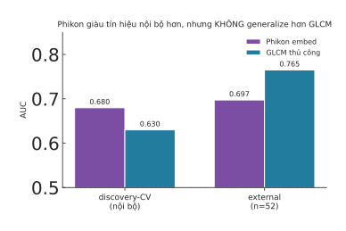

# Kết quả Phase 1: Pathology foundation embedding (Phikon) vs GLCM thủ công

> Ngày: 2026-07-22 · Mã: `experiments/foundation_embed/` · Kết quả: `results/fm_pathology.json`
> Hình: `fig-phikon-vs-glcm.svg` · Embedding cache: `path_fm_embed_{discovery,path_valid}.parquet` + `cache/*.npy`

## TL;DR

Giả thuyết "foundation embedding generalize hơn feature thủ công" — **Phase 1 (Phikon + mean-pool) CHƯA xác nhận**:
Phikon **giàu tín hiệu hơn nội bộ** (discovery-CV 0.680 vs GLCM 0.630) nhưng **KHÔNG vượt GLCM ngoài mẫu**
(external 0.697 vs 0.765, cùng 52 bệnh nhân, Δ=−0.068 nhưng CI chồng nhiều → không có ý nghĩa). Chưa kết luận
ý tưởng sai — vì **mean-pool là cách gộp thô nhất**; bước công bằng tiếp theo là ABMIL + CONCH.

## Kết quả

Pipeline: WSI `.svs` → tile 256²@20x trong vùng Tumor (HALO) → **Phikon** (ViT-B, 768-dim) → mean-pool/slide.
So với GLCM PD-L1 IHC thủ công. Đánh giá LR (sạch, công bằng).

| | discovery-CV (5-seed) | external (train discovery → test, cùng n=52) |
|---|---|---|
| **Phikon embed** | **0.680 ± 0.018** | 0.697 [0.53, 0.85] |
| **GLCM thủ công** | 0.630 ± 0.017 | **0.765 [0.61, 0.89]** |

- **Nội bộ:** Phikon > GLCM (+0.05) → embedding foundation model *có* bắt được nhiều tín hiệu hơn.
- **Ngoài mẫu:** Phikon < GLCM (−0.068), nhưng CI [0.53,0.85] vs [0.61,0.89] **chồng nhau lớn** → khác biệt trong nhiễu
  (n=52, pos=38, CI rộng ~0.3). Không thể nói GLCM *thật sự* hơn, chỉ là Phikon KHÔNG cải thiện được như kỳ vọng.
- Đáng chú ý: Phikon nội bộ 0.680 → external 0.697 (ổn định, tự generalize tốt); GLCM 0.630 → 0.765 (external cao
  hơn nội bộ — có thể do tập external 52 người "dễ" với GLCM, mẫu nhỏ).

## Vì sao chưa kết luận ý tưởng sai

1. **mean-pool là điểm yếu lớn nhất.** Trung bình *mọi* tile vùng u làm loãng vùng tín hiệu; chuẩn mực là **ABMIL**
   (attention học trọng số tile) — thường +0.03–0.08 so với mean-pool. Đây là thí nghiệm công bằng còn thiếu.
2. **Phikon là bản miễn phí thay thế.** **CONCH** (gated) generalize tốt hơn theo benchmark 2025.
3. **n external nhỏ (52).** CI rất rộng → mọi kết luận đều yếu về thống kê.
4. GLCM ở đây không phải radiomics chung chung mà là **texture PD-L1 IHC** — feature thủ công *đã* rất khớp task,
   nên "đối thủ" mạnh bất thường (khác hẳn radiomics CT vốn không generalize).

## Quyết định & Phase 2

**Phase 1 = kết quả trung tính-âm cho mean-pool**, KHÔNG bác bỏ ý tưởng. Trước khi chốt, cần **Phase 2 (thí nghiệm
công bằng)**:
- **ABMIL** thay mean-pool: lưu embedding *từng tile* (không chỉ mean), train attention-MIL với CV chống rò rỉ.
- **CONCH** thay Phikon (nếu xin được quyền HF).
- Có thể chuyển hướng đòn bẩy sang **radiology** (radiomics CT external ~0.46 — dư địa lớn hơn nhiều so với pathology
  vốn đã tốt với GLCM). Đây có khi là chỗ foundation embedding tạo khác biệt rõ nhất.

## Assets đã lưu (không phải chạy lại)
- `path_fm_embed_discovery.parquet` (163×768), `path_fm_embed_path_valid.parquet` (71×768)
- `experiments/foundation_embed/cache/*.npy` (embedding mean-pool từng slide; đổi CONCH mới cần trích lại)
- `results/fm_pathology.json`, `results/fm_slide_map.csv`, `results/fm_setup.json`
