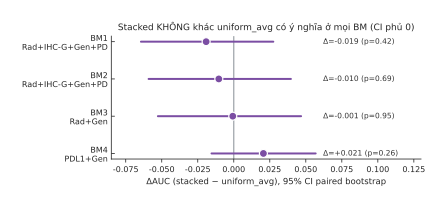
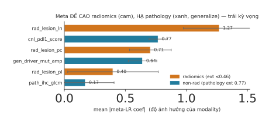

# Kết quả: Stacked Late-Fusion (thay attention) — NEGATIVE FINDING

> Ngày: 2026-07-21 · Mã: `experiments/stacked_fusion/` · Kết quả: `experiments/results/stacked.json`,
> `stacked_weights.json` · Hình: `fig-forest-delta.svg`, `fig-meta-weights.svg`

## TL;DR

Stacked late-fusion **ngang** backbone `uniform_avg` về AUC nội bộ (không thua có ý nghĩa ở BM nào)
nhưng **KHÔNG cung cấp câu chuyện diễn giải/robustness** như kỳ vọng — đó là lý do duy nhất để đề xuất
nó. Giả thuyết trung tâm ("meta-LR học từ OOF sẽ tự hạ trọng số radiomics không generalize") **bị dữ liệu
bác bỏ**: meta thực chất *đề cao* radiomics và *bỏ* pathology. → **Không đưa vào paper như phương pháp đề
xuất; ghi nhận là negative finding** củng cố thông điệp: cohort này không còn đòn bẩy fusion, và trọng số
học in-sample không thể mã hoá generalization.

## 1. Mô hình

Mỗi modality → base LR → dự đoán **out-of-fold** (inner 5-fold trong outer-train) → **meta-LR** học trọng
số modality từ OOF. Chống rò rỉ: L1 filter radiomics fit trên outer-train; base refit full outer-train mới
chạm outer-val; modality vắng mặt → base-pred 0 sau z-score. Base=LR (`balanced`, L2, C=1) vì neural≈LR.

## 2. AUC nội bộ — ngang uniform_avg, không hơn

Bảng AUC (mean±sd 5 seed × 10-fold) và ensemble 5-seed:

| method | BM1 | BM2 | BM3 | BM4 | BM1·ens | BM2·ens | BM3·ens | BM4·ens |
|---|---|---|---|---|---|---|---|---|
| uniform_avg (nền) | 0.775±0.019 | 0.767±0.011 | 0.711±0.015 | 0.719±0.008 | **0.785** | **0.774** | 0.726 | 0.724 |
| original (attn) | 0.760±0.022 | 0.764±0.018 | 0.709±0.018 | 0.707±0.009 | 0.775 | 0.776 | 0.726 | 0.712 |
| OvO (attn) | 0.773±0.020 | 0.763±0.010 | 0.713±0.015 | 0.718±0.012 | 0.784 | 0.771 | 0.726 | 0.722 |
| lr_late | 0.762±0.010 | 0.756±0.005 | 0.697±0.008 | 0.751±0.008 | 0.768 | 0.762 | 0.702 | 0.751 |
| **stacked** | 0.752±0.015 | 0.748±0.010 | 0.708±0.012 | 0.742±0.007 | 0.766 | 0.764 | 0.725 | 0.745 |

Paired bootstrap **stacked − uniform_avg** (`fig-forest-delta.svg`): mọi BM có CI 95% **phủ 0**
→ không khác có ý nghĩa (BM1 Δ−0.019 p=0.42 · BM2 Δ−0.010 p=0.69 · BM3 Δ−0.001 p=0.95 · BM4 Δ+0.021 p=0.26).
Stacked gần như trùng `lr_late` (cùng họ late-fusion tuyến tính). Seed-ensemble và Brier: **không** lợi thế.

**Điều kiện (a) "không thua có ý nghĩa" — ĐẠT.**

## 3. Trọng số meta — GIẢ THUYẾT BỊ BÁC BỎ (điều kiện b TRƯỢT)

Kỳ vọng: meta hạ radiomics (không generalize), giữ pathology (generalize ext 0.767) → trọng số trung thực,
diễn giải được, thay cho attention trơ. **Thực tế ngược lại** (`fig-meta-weights.svg`, BM1, mean|coef|):

| modality | mean\|coef\| | ghi chú |
|---|---|---|
| `rad_lesion_ln` (radiomics) | **1.27** | cao nhất mọi modality |
| `cnl_pdl1_score` | 0.77 | |
| `rad_lesion_pc` (radiomics) | 0.71 | |
| `gen_driver_mut_amp` | 0.64 | |
| `rad_lesion_pl` (radiomics) | 0.40 | |
| `path_ihc_glcm` (pathology) | **0.17** | ≈0 — modality generalize DUY NHẤT lại bị bỏ |

radiomics mean|coef| 0.79 **>** non-rad 0.53 (tỉ lệ non/rad = 0.67x BM1, 0.54x BM2).

**Vì sao:** meta học từ OOF *trong cohort discovery*, nơi radiomics vẫn informative in-sample. Đòn bẩy
"generalization" chỉ lộ ra ở cohort *ngoài* — mà meta không bao giờ thấy. Nên stacked **tái lập đúng bias
in-sample** của attention cũ, không sửa được nó. Trọng số ổn định qua seed/fold, nhưng kể *sai* câu chuyện.

## 4. Ngoài mẫu — trọng số phản-robust

Cohort ngoài đều **đơn-modality** → stacked rút gọn về base learner, **không test được fusion đa-modality
ngoài mẫu** (giới hạn thật). External base-LR: pathology **0.765**, radiomics **0.461**. Ghép với §3:
meta đề cao đúng modality *fail* ngoài mẫu (radiomics) và bỏ modality *generalize* (pathology)
→ trọng số stacked **phản-robust** với domain shift, không phải robust hơn như kỳ vọng.

## 5. Quyết định (tiêu chí 1.2)

- (a) không thua uniform_avg có ý nghĩa: **ĐẠT**.
- (b) trọng số meta diễn giải hợp lý (hạ radiomics, giữ pathology): **TRƯỢT** — ngược hoàn toàn.
- Điều khoản "ngang nhưng diễn giải tốt hơn → GIỮ" **không áp dụng**: diễn giải ở đây *sai lệch*, tệ hơn
  attention chứ không hơn.

**→ KHÔNG đề xuất stacked trong paper như phương pháp mới.** Đóng gói thành **negative finding**:

> Late-fusion xếp chồng với trọng số học từ dữ liệu (kể cả OOF) không sửa được thiên lệch overweight-radiomics,
> vì tín hiệu in-sample của radiomics mạnh còn thất bại generalization chỉ lộ ngoài mẫu. Củng cố khuyến nghị:
> với cohort này, dùng backbone `uniform_avg` (đơn giản, không tham số, ngang mọi biến thể) và bán câu chuyện
> ở trục **pathology generalize / radiomics không** — không phải ở trọng số fusion học được.

**Không `rm -rf` folder**: mã + kết quả + hình là bằng chứng cho negative finding (giá trị cho phần Discussion/
Limitation của paper). Đề xuất **giữ**; nếu muốn gọn có thể chuyển vào mục "explored, not adopted".

## 6b. Phụ lục — thử 2 đòn bẩy chưa test (prune + trọng số tin cậy), BM1

Kết quả `run_prune_weight.py` → `results/prune_weight.json`. Đối chiếu: uniform_avg khoá 0.7746 / ens 0.7850.

**Ý #2 — Prune modality nhiễu (trên backbone uniform_avg thật):** KHÔNG giúp.

| config | #mod | mean±sd | ens | Δmean | p vs ref |
|---|---|---|---|---|---|
| full (ref) | 6 | 0.7746±0.019 | 0.7850 | +0.000 | 1.00 |
| drop `pl` (n=21) | 5 | 0.7687±0.014 | 0.7791 | **−0.006** | 0.52 |
| drop `pl`+`ln` | 4 | 0.7734±0.019 | 0.7861 | −0.001 | 0.93 |
| drop toàn bộ radiomics | 3 | 0.7373±0.014 | 0.7418 | **−0.037** | 0.073 |

Bỏ modality nhiễu nhất (`rad_lesion_pl`) lại *hại* nhẹ; bỏ hết radiomics hại rõ (−0.037, gần p<0.05). Kể cả
modality gần-nhiễu vẫn đóng góp chút khi có mặt (mask xử lý vắng mặt). → **prune không nâng AUC nội bộ.**

**Ý #1 — Trọng số theo độ tin cậy (LR-late, wᵢ = AUCᵢ−0.5):** giúp *trong họ LR-late* nhưng chỉ *bằng* backbone.

| variant | mean±sd | ens |
|---|---|---|
| lr_late trọng số đều | 0.7651±0.013 | 0.7759 |
| lr_late trọng số theo AUC | **0.7747±0.011** | 0.7805 |

Trọng số tin cậy kéo LR-late +0.0096 (0.765→0.775), *lấp đúng khoảng cách* với uniform_avg (0.7746) nhưng
**không vượt** ens của nó (0.7805 < 0.7850). *Caveat:* trọng số AUC lấy từ `signal_audit` (cùng cohort) → rò rỉ
in-sample nhẹ, nên +0.0096 là ước lượng lạc quan.

**Kết luận phụ lục:** cả hai đòn bẩy đều **không tạo mô hình vượt uniform_avg+ensemble (0.785)** về AUC nội bộ —
tái khẳng định trần tín hiệu. Mô hình tốt nhất vẫn là **uniform_avg + seed-ensemble**, và nó đã hơn DyAM (0.775).

## 6. Liên kết
- `experiments/stacked_fusion/{model_stack,run_stack,run_weights,run_ensemble_stack,run_external_note,run_final}.py`
- `experiments/results/stacked.json` (AUC + compare + ensemble + external_note), `stacked_weights.json`
- Bối cảnh: `document/2026-07-20_attention-redesign/` (attention cạn), `document/2026-07-21_feature-validation/`
  (pathology generalize, radiomics không)
