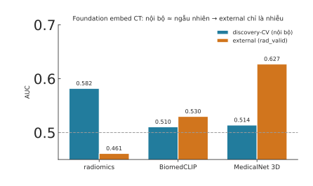

# Kết quả Phase 3: CT 3D foundation embedding (MedicalNet) vs radiomics/BiomedCLIP

> Ngày: 2026-07-22 · Mã: `experiments/foundation_embed/ct3d_*` · Kết quả: `results/fm_ct3d.json`
> Hình: `fig-ct3-models.svg` · Cache: `ct3d_fm_embed_{discovery,rad_valid}.parquet` + `cache/ct3d_*.npy`

## TL;DR

**fmcib không cài được trên Windows** (build gãy) → dùng fallback **MONAI MedicalNet 3D ResNet50 pretrained**.
Kết quả: MedicalNet 3D cũng **gần như ngẫu nhiên ở nội bộ (0.514)** — như BiomedCLIP, kém radiomics (0.582).
External 0.627 *nhìn* cao nhất **nhưng là NHIỄU** (nội bộ ngẫu nhiên + CI [0.44,0.81] cực rộng, n=46).
→ Không có bằng chứng CT foundation embedding (off-the-shelf) phá được rào generalization.

## Kết quả 3 model

| model | discovery-CV (nội bộ) | external (rad_valid) |
|---|---|---|
| radiomics thủ công | **0.582 ± 0.024** | 0.461 [0.23, 0.68] |
| BiomedCLIP 2.5D | 0.510 ± 0.019 | 0.530 [0.35, 0.72] |
| **MedicalNet 3D** | 0.514 ± 0.027 | 0.627 [0.44, 0.81] |

**Đọc đúng:** cả hai CT foundation embedding (BiomedCLIP, MedicalNet) đều **≈0.51 nội bộ = ngẫu nhiên** — không bắt
được tín hiệu response. External của MedicalNet 0.627 **KHÔNG đáng tin**: model không học được gì ở nội bộ thì không
thể "generalize"; CI [0.44,0.81] phủ cả dưới 0.5, chồng hoàn toàn với radiomics — khác biệt trong nhiễu thuần.

## Vì sao (trung thực)

- **MedicalNet pretrain cho segmentation** (nhận diện cấu trúc giải phẫu), không cho đặc trưng-hoá u dự đoán response
  → CLS/pooled feature không mang tín hiệu task. Giống BiomedCLIP: sai mục tiêu pretrain.
- **fmcib (đúng model: SimCLR trên lesion CT) không chạy được ở đây** — build gãy trên Windows, weights không public HF.
  Đây là hạn chế môi trường, không phải kết luận về fmcib. fmcib thật cần Linux/Colab.
- n external nhỏ (46), CI rộng → mọi so sánh yếu về thống kê.

## Tổng kết cả 3 phase foundation embedding

| Phase | Model | nội bộ | external | so hand-crafted |
|---|---|---|---|---|
| P1 pathology | Phikon (mean-pool) | **0.680** (có tín hiệu) | 0.697 | thua GLCM 0.765 |
| P2 radiology | BiomedCLIP 2.5D | 0.510 (random) | 0.530 | ~ radiomics 0.461 |
| P3 radiology | MedicalNet 3D | 0.514 (random) | 0.627 (nhiễu) | không đáng tin |

**Kết luận chung — trung thực:** trên cohort nhỏ này, **foundation embedding off-the-shelf (+ gộp đơn giản) KHÔNG vượt
feature thủ công.** Chỉ Phikon (pathology) bắt được tín hiệu nội bộ thật nhưng vẫn không vượt GLCM external. Các CT
foundation model thử được đều không có tín hiệu nội bộ. Đây là **kết quả âm nhất quán và đáng công bố** (dùng model
đơn giản + hiểu dữ liệu > chạy theo kiến trúc/embedding phức tạp).

## Điều kiện để KHÔNG đóng chặt ý tưởng (nếu có tài nguyên)
- **fmcib thật** (cancer-CT chuyên biệt) trên Linux/Colab — model đúng cho radiology, chưa test được ở đây.
- **CONCH + ABMIL** cho pathology — model + gộp đúng chuẩn.
- Nếu cả hai vẫn không vượt → **giới hạn nằm ở dữ liệu (n nhỏ, trần tín hiệu), không phải feature** — thông điệp paper mạnh nhất.

## Assets
- `ct3d_fm_embed_{discovery,rad_valid}.parquet` (188/47 × 2048), `cache/ct3d_*.npy`, `results/fm_ct3d.json`
