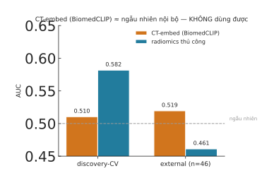

# Kết quả Phase 2: CT foundation embedding (BiomedCLIP) vs radiomics thủ công

> Ngày: 2026-07-22 · Mã: `experiments/foundation_embed/ct_*` · Kết quả: `results/fm_ct.json`
> Hình: `fig-ct-vs-radiomics.svg` · Cache: `ct_fm_embed_{discovery,rad_valid}.parquet` + `cache/ct_*.npy`

## TL;DR

**Kết quả ÂM rõ ràng.** CT-embed (BiomedCLIP, 2.5D mean-pool) **gần như ngẫu nhiên ngay ở nội bộ** (discovery-CV
0.510) — kém cả radiomics thủ công (0.582). External cả hai đều ~0.5 (vô dụng). → BiomedCLIP mean-pool **không bắt
được tín hiệu** cho task này. KHÔNG phá được rào generalization của radiomics (vì bản thân nó cũng không có tín hiệu).

## Kết quả

Pipeline: CT `.nii` + mask `.mha` → chọn series khớp size → window soft-tissue → lát axial qua lesion (crop bbox)
→ **BiomedCLIP** encode_image (512-dim) → mean-pool/volume. So với radiomics largest-lesion + SelectKBest(30). LR.

| | discovery-CV (5-seed) | external (rad_valid, cùng n=46) |
|---|---|---|
| **CT-embed (BiomedCLIP)** | 0.510 ± 0.019 | 0.519 [0.35, 0.72] |
| **radiomics thủ công** | 0.582 ± 0.024 | 0.461 [0.23, 0.68] |

- **CT-embed nội bộ ≈ 0.51 = ngẫu nhiên** — embedding hầu như không tách được 2 lớp. Đây là dấu hiệu model KHÔNG phù hợp.
- External CT-embed 0.519 vs radiomics 0.461: nominal +0.058 nhưng **vô nghĩa** vì nội bộ đã ngẫu nhiên (model chưa
  học được gì thì external chỉ là nhiễu); CI [0.35,0.72] vs [0.23,0.68] chồng nhau khổng lồ.

## Vì sao âm (đọc trung thực)

1. **BiomedCLIP là model SAI cho việc này.** Nó là vision-language *tổng quát* huấn luyện trên cặp (hình-caption)
   từ paper — mạnh cho nhận diện loại ảnh/mô tả, nhưng **CLS embedding của một lát cắt lesion không mã hoá được
   texture CT tinh vi** mà radiomics nhắm tới. 0.51 nội bộ khẳng định điều này.
2. **2.5D mean-pool là cách thô** — mất thông tin 3D thể tích của khối u.
3. n nhỏ (external 46), CI cực rộng.

## Quyết định

**Phase 2 (BiomedCLIP + mean-pool) = âm rõ.** Cùng với Phase 1 (Phikon pathology cũng không vượt GLCM external),
**hai lần thử foundation-embedding dạng mean-pool đều KHÔNG cải thiện** trên cohort này. Bằng chứng đang tích luỹ:

> Trên bộ dữ liệu nhỏ này, với feature thủ công vốn đã được tinh chỉnh, **foundation-embedding + mean-pool không phải
> đòn bẩy** — pathology thì thua nhẹ GLCM, radiology thì BiomedCLIP không có tín hiệu.

**Điều kiện để cho foundation-embedding một cơ hội CÔNG BẰNG (Phase 3, nếu theo tiếp):**
- **Radiology:** dùng **CT foundation model chuyên dụng 3D** (CT-FM / Merlin) thay BiomedCLIP tổng quát — đây là
  nghi phạm chính. BiomedCLIP không đại diện cho "foundation embedding cho CT".
- **Pathology:** **ABMIL** thay mean-pool + **CONCH** thay Phikon.
- Nếu cả hai vẫn không vượt → bằng chứng mạnh rằng **giới hạn nằm ở dữ liệu (n nhỏ, tín hiệu trần), không phải feature**
  — bản thân đây là kết luận đáng công bố (âm nhưng trung thực).

## Assets đã lưu
- `ct_fm_embed_discovery.parquet` (188×512), `ct_fm_embed_rad_valid.parquet` (47×512), `cache/ct_*.npy`
- `results/fm_ct.json`, `results/ct_slide_map.csv`, `results/ct_setup.json`
