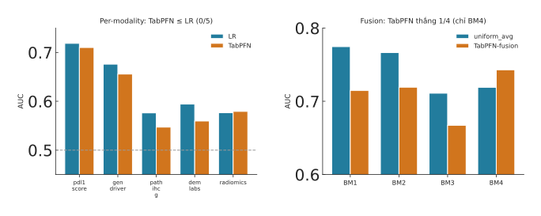

# Kết quả: TabPFN (tabular foundation model) vs LR/uniform_avg

> Ngày: 2026-07-22 · Mã: `experiments/tabpfn_exp/` · Kết quả: `results/tabpfn_{single,external,fusion}.json`
> Hình: `fig-tabpfn.svg` · Bản dùng: **tabpfn 2.2.1** (v8+ bắt buộc login → downgrade v2 local)

## TL;DR

TabPFN — tabular foundation model chuyên dữ liệu nhỏ — **không vượt LR/uniform_avg** trên cohort này:
per-modality thắng **0/5**, external không hơn, fusion thắng **1/4** (chỉ BM4 — combo 2-modality nhỏ). Khớp
literature ("established ML matches tabular foundation models") và finding cũ (neural≈LR). **Giá trị: comparator
hiện đại hợp lệ để đưa vào paper, không phải cải tiến.**

## Kết quả

**Per-modality (discovery-CV 5-seed):**

| modality | LR | TabPFN |
|---|---|---|
| PDL1 | 0.7186 | 0.7101 |
| Gen (mut_amp) | 0.6760 | 0.6557 |
| GLCM pathology | 0.5762 | 0.5471 |
| Labs | 0.5942 | 0.5596 |
| radiomics (largest) | 0.5765 | 0.5793 |

→ TabPFN < LR ở 4/5, ngang ở radiomics. **0/5 vượt.**

**External (train discovery → test):**

| modality | LR | TabPFN |
|---|---|---|
| pathology → path_valid | **0.767** | 0.748 |
| radiomics → rad_valid | 0.436 | 0.481 (cả hai ~ngẫu nhiên) |

→ Không generalize hơn (thấp hơn ở pathology; radiomics vô nghĩa hai bên).

**Fusion late (TabPFN per-modality OOF → trung bình có-mask, 3-seed) vs uniform_avg khoá:**

| BM | TabPFN-fusion | uniform_avg | Δ |
|---|---|---|---|
| BM1 | 0.7149 | 0.7746 | **−0.060** |
| BM2 | 0.7192 | 0.7665 | −0.047 |
| BM3 | 0.6672 | 0.7110 | −0.044 |
| BM4 | **0.7430** | 0.7191 | **+0.024** |

→ Thắng 1/4 (BM4). Thua rõ ở các combo có radiomics (radiomics OOF của TabPFN thêm nhiễu vào fusion).

## Đọc kết quả

- TabPFN **ngang hoặc dưới** LR/uniform_avg ở mọi trục — trừ **BM4** (PDL1+Gen: 2 modality, ít chiều, sạch), nơi
  in-context learning của TabPFN có nhỉnh (+0.024). Đây là quan sát trung thực: TabPFN hợp cấu hình *ít-modality-sạch*,
  nhưng bị radiomics (nhiều chiều, nhiễu) kéo xuống trong fusion.
- Nhất quán với toàn bộ dự án: **neural≈LR, attention=uniform, embedding không giúp, và giờ TabPFN cũng không.**
  Củng cố thông điệp trung tâm: **trần nằm ở dữ liệu, model đơn giản (uniform_avg/LR) đã đủ.**

## Giá trị cho paper
- Thêm TabPFN làm **comparator foundation-model hiện đại** (reviewer sẽ hỏi) — kết quả "ngang/không hơn" là bằng
  chứng sạch, hợp trend literature 2025–2026.
- Không GIỮ như phương pháp cải tiến; đưa vào bảng so sánh + 1 câu trong Discussion.

## Assets
- `experiments/tabpfn_exp/{tabpfn_eval,step1_single,step2_external,step3_fusion,step4_fig}.py`
- `results/tabpfn_single.json`, `tabpfn_external.json`, `tabpfn_fusion.json`
