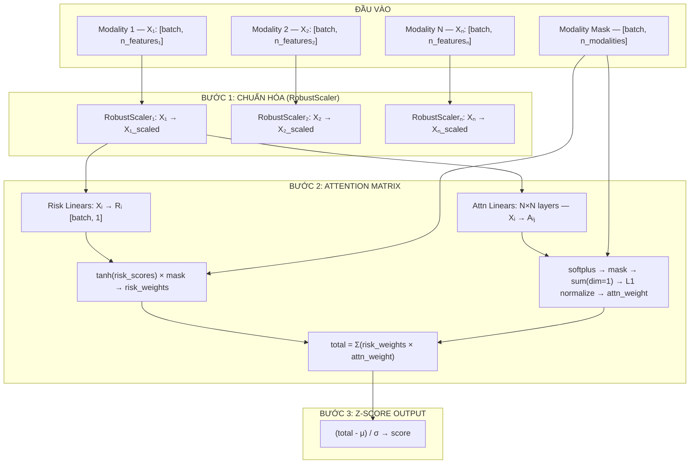

# Kiến trúc Mô hình DyAM (MultiModalDynamicModel)

> Tài liệu tổng hợp kiến trúc, luồng dữ liệu, và ví dụ chi tiết của mô hình gốc.

---

## 1. Tổng quan

`MultiModalDynamicModel` là mô hình học sâu (PyTorch) cho **phân loại nhị phân** trên dữ liệu đa phương thức (multimodal). Mô hình học trọng số rủi ro riêng cho từng modality và trọng số attention để phối trộn các modality, đồng thời hỗ trợ thiếu modality qua `mask`.

**Modality** là một nguồn hoặc loại dữ liệu riêng biệt (ảnh CT, genomics, lâm sàng). Mỗi modality có cấu trúc dữ liệu, ý nghĩa lâm sàng, và độ tin cậy khác nhau. Trong dự án này:

| Modality | Mô tả | Số chiều |
|----------|-------|---------|
| Radiomics | Đặc trưng hình ảnh CT (texture, shape, intensity) | Hàng trăm → sau filter ~45 |
| Clinical | Tuổi, ECOG, pack-years, albumin, dNLR, ... | 13 |
| Genomics | Đột biến gen, TMB, amplification | ~8–20 |
| Pathology | Đặc trưng IHC từ ảnh mô sinh thiết | ~50–100 |

---

## 2. Sơ đồ kiến trúc



---

## 3. Tham số khởi tạo `MultiModalDynamicModel`

```python
model = MultiModalDynamicModel(
    epochs=100,                    # Số vòng lặp huấn luyện
    alpha=1.0,                     # Hệ số phạt L2 trọng số
    beta=1.0,                      # Hệ số phạt attention norm
    lr=0.01,                       # Learning rate Adam
    cross_modality_enabled=False,  # Nếu False, chỉ cho attention nội-modality (đường chéo)
    attention_gate_enabled=True,   # Nhân attention vào risk (nếu False chỉ cộng đơn)
    no_scale=[],                   # Index modality không qua RobustScaler
    hidden_factor=2,               # Chưa dùng (legacy)
    class_weight='balanced'        # Chưa dùng trực tiếp — pos_weight tính từ tỉ lệ lớp
)
```

---

## 4. Các thành phần kiến trúc chi tiết

### 4.1. AttentionMatrix

Module core. Nhận danh sách tensor `inputs` (mỗi tensor = 1 modality) và `mask`.

**Các lớp Linear được tạo động:**

- **`l_risk_linears`**: N lớp `nn.Linear(n_features_i, 1)` — một lớp per modality, tính risk score thô
- **`l_attn_linears`**: N×N lớp `nn.Linear(n_features_i, 1)` — mỗi modality i dùng N lớp để tính attention đến mỗi modality j

**Ví dụ với 3 modality (Rad 45f, Gen 8f, Clin 5f):**

```
Risk linears:  Linear(45→1), Linear(8→1), Linear(5→1)          — 3 lớp
Attn linears:  9 lớp: rad→rad, rad→gen, rad→clin,
                       gen→rad, gen→gen, gen→clin,
                       clin→rad, clin→gen, clin→clin
```

### 4.2. Luồng dữ liệu forward pass (chi tiết)

```
Input Modalities: [X₁, X₂, ..., Xₙ]  +  mask [batch, N]
        ↓
[RobustScaler per modality — trừ no_scale]
        ↓
Nhánh Risk:
  Xᵢ → Linear_Risk_i → Rᵢ [batch, 1]
  risk_scores = cat(R₀...Rₙ)   [batch, N]
  risk_weights = tanh(risk_scores) × linear_mask  [batch, N]

Nhánh Attention:
  Xᵢ → N lớp Linear_Attn_ij → Aᵢⱼ [batch, 1]   (chia n_features_i)
  attn_matrix = reshape(cat(Aᵢⱼ))  [batch, N, N]
  attn_matrix = softplus(attn_matrix)
  attn_matrix = matrix_mask × attn_matrix         (mask hàng/cột modality thiếu)
  [nếu cross_modality=False: nhân identity_mask → chỉ giữ đường chéo]
  attn_scores = linear_mask × attn_matrix.sum(dim=1)  [batch, N]
  attn_weight = F.normalize(attn_scores, p=1)          [batch, N]  ← tổng = 1

Kết hợp:
  total_risk = Σ(risk_weights × attn_weight)  [batch]   [nếu attention_gate_enabled]
  total_risk = Σ(risk_weights)                [batch]   [nếu tắt]

Output:
  response_zscore(total_risk, target) → score [batch]
```

**Bảng kích thước tensor:**

| Tensor | Kích thước | Mô tả |
|--------|------------|-------|
| `Xᵢ` | `[batch, n_features_i]` | Dữ liệu modality i |
| `mask` | `[batch, N]` | 1=có, 0=thiếu |
| `risk_weights` | `[batch, N]` | tanh(risk) × mask |
| `attn_matrix` | `[batch, N, N]` | Attention nội bộ (không return) |
| `attn_weight` (`mixing_matrix`) | `[batch, N]` | Trọng số attention đã chuẩn hóa |
| `total_risk` (`output`) | `[batch]` | Risk tổng hợp |
| `score` | `[batch]` | Z-score output |

### 4.3. RobustScaler

```
X_scaled = (X - median) / IQR
```

Dùng median và IQR thay vì mean/std → **kháng outlier** — rất phù hợp với dữ liệu y học. Mỗi modality được scale độc lập. Scaler được lưu lại sau `fit()` để dùng khi `predict()`.

Modality trong `no_scale` (ví dụ: NLP embeddings đã normalize cosine) bỏ qua bước này.

### 4.4. Response Z-score

Sau khi huấn luyện, normalize output:

```python
# Training:
threshold = find_optimal_cutoff(target, raw_scores)  # tối đa TPR - (1-FPR) trên ROC
mu  = threshold
std = raw_scores.std()
score = (raw_scores - mu) / std

# Inference:
score = (raw_scores - self.mu) / self.std  # dùng mu/std đã học
```

Kết quả: score > 0 → dự đoán SD/PD (không đáp ứng), score < 0 → PR/CR (đáp ứng). Ngưỡng 0 là điểm phân loại tự nhiên.

### 4.5. Loss function và tối ưu

```
Total Loss = (BCEWithLogitsLoss + α × L2_weight + β × attn_norm) / n_batch
```

- `BCEWithLogitsLoss` với `pos_weight = sum(neg) / sum(pos)` — tự động cân bằng lớp
- `L2_weight = Σ||W||₂` — regularization trọng số
- `attn_norm = ||attn_matrix||₂` — phạt attention quá lớn, khuyến khích phân tán
- Adam optimizer, batch size 256

---

## 5. Ví dụ số liệu cụ thể (1 bệnh nhân, 3 modality)

```
Bệnh nhân có đủ Rad (45f), Gen (8f), Clin (5f):

Risk scores (raw):   [0.12, 0.25, 0.18]
risk_weights (tanh): [0.12, 0.25, 0.18]  (tanh nhỏ ≈ giá trị)

Attn matrix (sau softplus):
  [0.5, 0.3, 0.2]   (Rad → Rad/Gen/Clin)
  [0.2, 0.6, 0.2]   (Gen → ...)
  [0.3, 0.3, 0.4]   (Clin → ...)

Sum(dim=1) = tổng mà từng modality nhận được:
  Rad: 0.5+0.2+0.3 = 1.0
  Gen: 0.3+0.6+0.3 = 1.2  ← cao nhất
  Clin: 0.2+0.2+0.4 = 0.8

attn_weight (L1 normalize): [0.333, 0.400, 0.267]

total_risk = 0.12×0.333 + 0.25×0.400 + 0.18×0.267 = 0.188

→ Z-score: (0.188 - 0.05) / 0.15 = 0.92  → dự đoán SD/PD
```

**Bệnh nhân thiếu Clinical (mask=[1,1,0]):**
```
Cột/hàng Clin trong attn_matrix → 0
attn_scores = [Rad: 0.7, Gen: 0.9, Clin: 0.0]
attn_weight = [0.438, 0.562, 0.0]  ← Rad+Gen tăng để bù

total_risk = 0.15×0.438 + 0.20×0.562 = 0.178
```

---

## 6. MaskedMultiModalLoader

`Dataset` PyTorch. Nhận `list_X_inputs` (list tensor per modality), `mask_tensor`, `labels_tensor`. Trả về batch đồng bộ. Kiểm tra n_samples khớp giữa tất cả modality.

---

## 7. Quy trình `fit()` tóm tắt

1. Copy dữ liệu, khởi tạo `AttentionMatrix` theo số modality
2. Scale từng modality bằng `RobustScaler` (trừ `no_scale`), lưu scaler
3. Tạo mask tensor, labels tensor
4. Thiết lập `BCEWithLogitsLoss` với `pos_weight`, Adam optimizer
5. Lặp qua DataLoader (batch=256):
   - Forward: lấy `output, risk_scores, mixing_matrix, ar2, rr2`
   - Loss: `(bce + alpha*l2 + beta*ar2) / n_batch`
   - Backward + step
6. Forward toàn bộ → normalize output qua `response_zscore` → trả về scores

## 8. `predict_proba` và `get_summary_scores`

- `predict_proba(X, mask)` → scores đã z-score
- `get_summary_scores(X, mask)` → `(score, risk_weights, mixing_matrix, attention_share)` — dùng để phân tích đóng góp từng modality

`attention_share = share_factor × mixing_matrix`, với `share_factor = số modality có mặt` per sample.

---

## 9. Đặc tính và lưu ý thực hành

- **Hỗ trợ thiếu modality**: mask tự động đặt attention=0 cho modality thiếu, tái normalize trọng số còn lại
- **Cross-modality**: khi tắt (`cross_modality_enabled=False`, mặc định), attention matrix chỉ giữ đường chéo — nhanh hơn, ít overfit hơn với n nhỏ
- **no_scale**: bắt buộc cho NLP embeddings (đã normalize cosine), bỏ qua với raw lab values
- **class_weight**: biến này hiện không dùng trực tiếp; cân bằng lớp thực sự qua `pos_weight` trong loss
- Nếu modality bị lọc hết đặc trưng sau L1 filter, bỏ qua fold đó

---

*Tổng hợp từ: `kien-truc-mo-hinh.md`, `giai-thich-mo-hinh.md`, `dyam-architecture.md`, `attention-matrix.md`*
